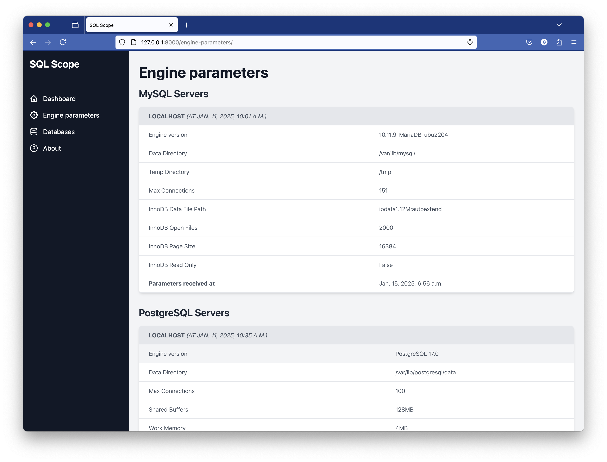
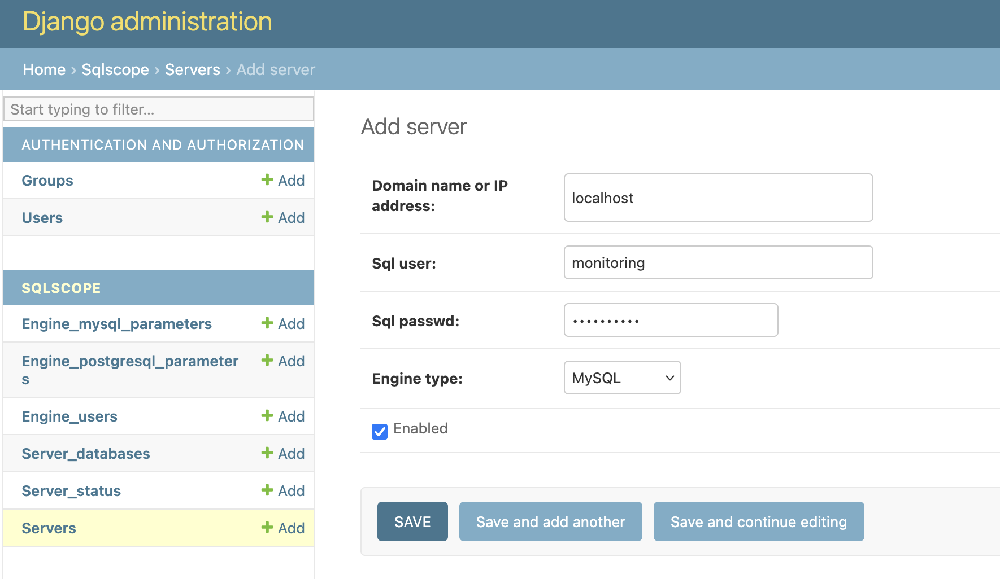

# Introduction

SQLScope is an open-source tool designed to provide insightful statistics about SQL servers on a dashboard.

The main goal is to check if our servers are up and if the server is a replica, ensuring that replication is working.


It currently supports (because tested with):

 - MySQL 5.7
 - PostgreSQL 17
 - MariaDB 10

Below is a preview of the dashboard:




SQLScope is built using the Django framework and requires a PostgreSQL database to operate.

For optimal deployment, you might consider setting up Nginx as a reverse proxy to handle FastCGI requests efficiently and SSL termination.

# Setup SQLScope
## Operating System

On Debian or Debian-like server:
```
apt install -y python3-venv postgresql nginx git
```

## Python dependencies

```
cd /opt
python3 -m venv venv-python3-django4
source venv-python3-django4/bin/activate
git clone https://github.com/gduale/sqlscope.git
cd sqlscope
pip install -r requirements.txt
```

## PostgreSQL configuration

Add a dedicated user for the application in the PosgtreSQL configuration file.

File `/etc/postgresql/15/main/pg_hba.conf`
```
# SQLscope
# TYPE  DATABASE        USER            ADDRESS                 METHOD
host    sqlscope_db     sqlscope        127.0.0.1/32            md5
```

And reload PostgreSQL:
```
systemctl reload postgresql
```

### Databse initialisation

With a PostgreSQL shell:
```
CREATE DATABASE sqlscope_db;
CREATE USER sqlscope WITH PASSWORD 'changeme';
ALTER ROLE sqlscope SET client_encoding TO 'utf8';
ALTER ROLE sqlscope SET default_transaction_isolation TO 'read committed';
ALTER ROLE sqlscope SET timezone TO 'UTC';
GRANT ALL PRIVILEGES ON DATABASE sqlscope_db TO sqlscope;
ALTER DATABASE sqlscope_db OWNER TO sqlscope;
```


## Start the app to test it
```
cd /opt/sqlscope/sqlscope
python manage.py makemigrations
python manage.py migrate
gunicorn --bind 0.0.0.0:8000 config.wsgi
```

You can verify if everything is working well, on: http://localhost:8000

*replace `localhost` with your public or private ip as appropriate.*

You can kill the command with *ctrl+c.*


## Start the app with systemd

### User creation and permissions
```
useradd -r -s /usr/sbin/nologin -M sqlscope
usermod -aG www-data sqlscope
chown -R sqlscope:www-data /opt/venv-python3-django4 /opt/sqlscope
```

### Gunicorn service file
File `/etc/systemd/system/gunicorn.service`
```
[Unit]
Description=gunicorn daemon
Requires=gunicorn.socket
After=network.target

[Service]
User=sqlscope
Group=www-data
WorkingDirectory=/opt/sqlscope/sqlscope
ExecStart=/opt/venv-python3-django4/bin/gunicorn \
          --access-logfile - \
          --workers 3 \
          --bind unix:/run/gunicorn.sock \
          config.wsgi:application

[Install]
WantedBy=multi-user.target
```

### Gunicorn socket file
File `/etc/systemd/system/gunicorn.socket`
```
[Unit]
Description=gunicorn socket

[Socket]
ListenStream=/run/gunicorn.sock

[Install]
WantedBy=sockets.target
```

### Enable systemd files
```
systemctl daemon-reload
systemctl start gunicorn.socket
systemctl enable gunicorn.socket
```

## Configure Nginx

File `/etc/nginx/sites-available/sqlscope`
```
server {
    listen 80;
    server_name <Your_IP>;

    location = /favicon.ico { access_log off; log_not_found off; }
    location /static/ {
        root /opt/sqlscope/sqlscope;
    }

    location / {
        include proxy_params;
        proxy_pass http://unix:/run/gunicorn.sock;
    }
}
```

*Replace <Your_IP> with your actual IP.*

### Enable the new vhost and restart Nginx
```
ln -s /etc/nginx/sites-available/sqlscope /etc/nginx/sites-enabled/sqlscope
systemctl restart nginx
```

You can now, access to SQLScope at `http://<Your_IP>/`.

## SQLScope configuration

Finish the Django configuration:
```
python manage.py createsuperuser
python manage.py collectstatic
```

To configure SQLScope, you can access the admin interface at `http://<Your_IP>/admin/`.

The only thing you need to setup is a new server, like this:



## Update the dashboard

The dashboard is updated automatically with the latest information from the servers when you run the script `sqlscope_cron.py`

You can run the script manually with:
```
python sqlscope_cron.py
```

Then, refresh the dashboard at `http://<Your_IP>/`